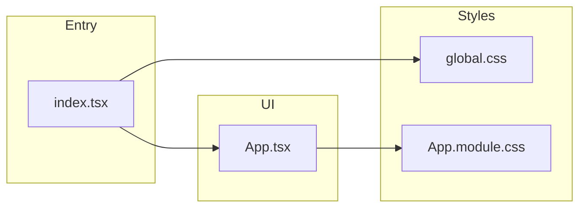

# CSS Modules + DRY style refactor

## Current pain (from [src/styles.css](src/styles.css) + [src/App.tsx](src/App.tsx))

- BEM-style names (`app-grid__cell--*`, `default-tile-*`, `tile-*`) are verbose; several blocks repeat the same declarations.
- **Ghost actions**: `.tile-rotate`, `.tile-distribute`, `.tile-delete`, `.reset-rotations-button`, and `.clear-all-button` share the same base (reset margin/padding/border/background, underline, small type, hover color differs).
- **Spread-exempt X overlay**: `.default-tile-thumb--spread-exempt` and `.tile-svg-wrap--spread-exempt` are byte-for-byte duplicate pseudo-element rules — should be one class on both nodes.
- **Preview chrome**: catalog thumb (28px) vs active tile wrap (32px) share “box + inset/outline shadow” patterns; one nested block with a size modifier (or two short classes composed from a shared base) reduces drift.
- `**.output`: [src/App.tsx](src/App.tsx) wraps the preview in `className="output"` but no CSS defines it; [robots.md](robots.md) mentions it. Either drop the wrapper or give it a real scoped rule (e.g. spacing under the grid).

## Target file layout

| File                                           | Role                                                                                                                                                                                                                 |
| ---------------------------------------------- | -------------------------------------------------------------------------------------------------------------------------------------------------------------------------------------------------------------------- |
| [src/global.css](src/global.css) (new)         | `html`, `body`, universal reset (`*`), `a`, and **element** rules that must not be hashed: `select`, `input[type="file"]` (+ `::file-selector-button`). Keeps “one place” for typography/accent/box-sizing defaults. |
| [src/App.module.css](src/App.module.css) (new) | All layout and App-specific UI: grid, panels, catalog, sequence list, preview, download link, errors. Heavy use of **nesting** under a few top-level blocks.                                                         |
| [src/index.tsx](src/index.tsx)                 | Add `import "./global.css"` before `App` so globals load once.                                                                                                                                                       |
| [src/App.tsx](src/App.tsx)                     | `import styles from "./App.module.css"`; replace string class names with `styles.`; optional small rename of wrapper elements for clarity.                                                                           |
| [src/styles.css](src/styles.css)               | Remove after migration (single consumer today).                                                                                                                                                                      |

Vite already treats `*.module.css` as CSS Modules; [src/vite-env.d.ts](src/vite-env.d.ts) references `vite/client`, so `styles` will be typed as `Record<string, string>`.

## Naming direction (generic, scoped by module)

Because names are file-local, short names are safe. Suggested mapping (illustrative — adjust for readability):

- `generator` → `root`
- `app-grid` / `app-grid__cell` / modifiers → nested `.grid` > `.cell` with area modifiers as sibling classes e.g. `cellTitle`, `cellControls`, `cellSliders`, `cellCatalog`, `cellActive` (or `areaTitle` …), applied together: `className={`${styles.cell} ${styles.cellTitle}`}`.
- `multi-container` / `multi-container--title` → `stack` / `stackCentered` (or `fieldStack` under `.cellControls`)
- `sliders-subgrid-panel` / `slider-row` → `ranges` / `rangeRow` (nested under `.ranges`)
- `tiles-column` / heading / empty → `panel` / `panelLabel` / `panelHint`
- `default-tile-list` / `default-tile-item` / `default-tile-thumb` / `default-tile-name` → `catalog` > nested `list`, `pick`, `thumb`, `label` (module scope makes `thumb` unambiguous)
- `tile-list` / `tile-item` / `tile-item-body` → `sequence` > `card`, `body`
- `tile-svg-wrap` / `tile-svg` / `tile-drag-icon` → nested under `.card` e.g. `preview`, `graphic`, `dragHint`
- `spread-exempt` (shared) → single exported class e.g. `spreadExempt` on both catalog thumb and active preview
- `tile-item--distribute` → `cardActive` or `card[data-distribute]` + attribute selector nested under `.card`
- `active-tiles-inner` / `active-tiles-actions` → `panelBody` / `toolbar`
- Ghost buttons → one class e.g. `textButton` with optional modifiers `textButtonDanger`, `textButtonAccent`, `textButtonSuccess` for hover colors (or CSS variables on a parent)
- `svg-container` → `previewFrame`; `download-svg-button` → `download`; `error` → `error`
- `upload-container` → `upload`

This replaces BEM **encoding structure in the name** with **structure in nested CSS** + short local names.

## DRY + nesting structure

1. **Single ghost/text button base** in [src/App.module.css](src/App.module.css):

```css
.textButton {
  /* shared reset + underline + transition */
}
.textButton:hover {
  /* default */
}
.textButtonAccent:hover {
  /* rotate / reset */
}
.textButtonSuccess:hover {
  /* distribute */
}
.textButtonDanger:hover {
  /* delete / clear */
}
```

Apply `textButton` + one variant to Rotate, Dist, Delete, Reset rotations, Clear all.

1. **Single `.spreadExempt` (or nested `.thumb.spreadExempt`)** for `::before`/`::after` X overlay; use the same class in catalog and active rows ([src/App.tsx](src/App.tsx) lines 464–468 and 503–506).
2. **Thumbs**: nest shared rules under `.thumb` with a modifier:

```css
.thumb {
  /* position relative, flex-shrink, shadow recipe */
}
.thumb svg {
  display: block; /* shared */
}
.catalog .thumb {
  width: 28px;
  height: 28px;
}
.card .preview {
  width: 32px;
  height: 32px; /* + grab cursor */
}
```

(Exact structure can merge `thumb` and `preview` if you prefer one element class name.)

1. **Grid**: nest `.cell` defaults inside `.grid`, then `.cellTitle`, `.cellCatalog`, etc. as additional classes or as `.grid .cell[data-area="title"]` if you want even flatter JSX — pick one style and use it consistently.
2. **Ranges panel**: nest `label` / `input[type="range"]` under `.rangeRow` to avoid repeating `.slider-row label` selectors.

The project already uses native CSS nesting in [src/styles.css](src/styles.css) (e.g. `.app-grid .multi-container`); keep the same syntax in the module file for consistency.

## `App.tsx` cleanup (minimal logic change)

- Replace `import "./styles.css"` with module + keep behavior identical.
- For compound classes, use template literals or a tiny local helper; **no new dependency required** (optional: add `clsx` later if you prefer).
- Rename only where it improves scanability (`root`, `grid`, `catalog`, `sequence`, `previewFrame`) — no state/handler renames unless clearly helpful.

## Documentation

- Update [robots.md](robots.md): replace “`.generator`, `.controls`, … `./styles.css`” with `global.css` + `App.module.css`, and fix the `.output` description to match the final markup (removed or styled).

## Verification

- Run `npm run build` and `npm run dev` smoke-check: grid layout, catalog hover, tile hover actions, spread-exempt overlay, file input styling, select appearance, SVG preview border, download link.


