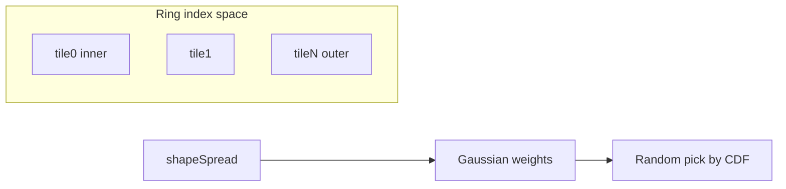

# Strategies: crisp shape vs blurry transitions

## Decided: spread-exempt catalog tile (like empty)

**User choice:** A dedicated tile **in the default catalog**, analogous to the built-in **empty** tile: transparent, always available, and **addable whenever** the user wants a **hard limit** for shape spread.

- **Placement = meaning:** Ring order is still `tiles` list order (circle: first = innermost, last = outermost). Putting the exempt tile **last** gives a crisp outer boundary; placing it **between** two decorative tiles inserts a ring that **cannot** receive probability from Gaussian spread from neighboring rings (and conversely, cells whose **ideal** ring is exempt only pick that tile—exact weighting rules below).
- **Visual:** Same as empty (fully transparent SVG) so the grid still looks like “nothing” there, but the app distinguishes it by **stable id** or `**fileName` (e.g. `spread-exempt.svg`) for generator logic.
- **Detection:** `isSpreadExempt(tile)` — true for this catalog entry (and any duplicate instances in "Tiles in use" share the same `fileName`/marker).

---

## What happens today (unchanged baseline)

In `selectTileCircle` (and gradient/exponential), `shapeSpread` scales a Gaussian in **ring index space**. Large σ leaks probability across many indices. There is no exempt concept yet.

---

## Implementation rules (exempt tile)

**Per cell:**

1. Compute **ideal ring index** `i` from **geometry only** (no Gaussian): the ring this cell would belong to if `shapeSpread` were 0 (nearest band / deterministic mapping—same for circle, gradient, exponential; each selector needs a small helper).
2. Build Gaussian weights over ring indices as today.
3. **Mask weights:**

- For every index `j` that is **spread-exempt**: if `j !== i`, set `weight[j] = 0` (spread cannot pull in the exempt tile unless this cell’s ideal ring is already exempt).
- Optionally symmetric: if `i` is **not** exempt, zero weights for all exempt indices (same as above).

1. **Renormalize** remaining weights; if sum is 0, fall back to deterministic `orderedTiles[i*]`.
2. **Multiple exempt indices:** If the user added several spread-exempt tiles at different list positions, each index is handled the same way (each is its own ring with hard edges).

**Edge cases:** `numTiles === 1`; all tiles exempt; document UX: list order still defines rings.

---

## Option A — spread limit (cap σ) — optional follow-up

Not required for the first slice. If blur still feels too wide **between non-exempt rings**, add `σ_eff = min(shapeSpread, σ_max)` derived from tile count and shape. Can combine later with exempt masking.

---

## Files to touch (when executing)

- `[src/utils/defaultTiles.ts](src/utils/defaultTiles.ts)` — second built-in entry + asset or inline SVG (mirror empty pattern).
- `[src/types.ts](src/types.ts)` — only if a new field is preferred over `fileName` convention (prefer convention to avoid migration).
- `[src/utils/svgutils.ts](src/utils/svgutils.ts)` — `isSpreadExempt`, ideal-index helpers, masked weighting in `selectTileCircle`, `selectTileGradient`, `selectTileExponential`.
- `[src/App.tsx](src/App.tsx)` — catalog list already renders preloaded tiles; ensure new tile appears (sorted assets + empty + exempt ordering TBD: e.g. `[empty, exempt, ...assets]`).

---

## Clarifications resolved

- **Exempt semantics:** Dedicated catalog tile (like empty), not a checkbox—user adds it to the sequence where they want hard boundaries.
- **Spread limit:** Deferred unless needed after exempt masking.
